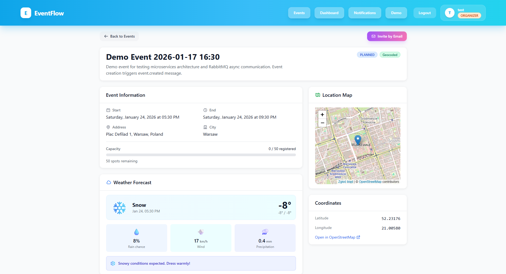

# EventFlow

[](https://openjdk.org/)
[](https://spring.io/projects/spring-boot)
[](https://reactjs.org/)
[](https://www.docker.com/)
[](https://www.rabbitmq.com/)
[](https://www.postgresql.org/)

EventFlow is a microservices-based event management platform demonstrating modern distributed system architecture with REST APIs, asynchronous messaging, external API integrations, and SMTP email notifications.

## Key Features

- **Full REST CRUD** operations for events, users, and registrations
- **Microservices architecture** with API Gateway pattern
- **PostgreSQL persistence** with database-per-service pattern
- **RabbitMQ messaging** for asynchronous event-driven communication
- **SMTP email notifications** via Mailtrap for event invitations
- **External API integrations**: Weather forecasts (Open-Meteo) and geocoding (Nominatim)
- **JWT authentication** with role-based authorization (USER, ORGANIZER)
- **Event invitations** system with secure token-based accept/decline links

## Architecture Overview

EventFlow implements a microservices architecture with service-oriented design principles. The API Gateway serves as the single entry point for all client requests, routing them to appropriate backend services.

- **API Gateway** (Port 18080) - Single entry point for client requests, handles JWT authentication, request routing, and CORS policies
- **user-service** (Port 8081) - Manages user authentication, JWT token generation, and user profile operations
- **event-service** (Port 8082) - Handles event lifecycle management, user registrations, invitation system, and integrates with external weather/geocoding APIs
- **notification-service** (Port 8083) - Processes in-app notifications and sends SMTP email notifications via asynchronous message consumption

Each service maintains its own PostgreSQL database following the database-per-service pattern. Inter-service communication uses RabbitMQ as an asynchronous message broker for event-driven operations.

## Technologies Used

**Backend**
- Java 17, Spring Boot 3.2.1, Spring Cloud Gateway
- Spring Security with JWT, Spring Data JPA
- Spring AMQP (RabbitMQ), JavaMail (SMTP)

**Frontend**
- React 18.2, Vite, TailwindCSS
- Axios, React Router

**Messaging & Database**
- RabbitMQ 3.13, PostgreSQL 15

**DevOps**
- Docker & Docker Compose
- Spring Boot Actuator for health checks

## Quick Start

**Requirements:** Docker & Docker Compose installed

**1. Configure SMTP (for email invitations)**

Create `docker/.env` file:
```env
MAIL_HOST=sandbox.smtp.mailtrap.io
MAIL_PORT=2525
MAIL_USERNAME=your_mailtrap_username
MAIL_PASSWORD=your_mailtrap_password
MAIL_FROM=noreply@eventflow.local
FRONTEND_BASE_URL=http://localhost:5173
```

Get credentials from [Mailtrap.io](https://mailtrap.io/) (free tier available).

**2. Start all services**
```bash
cd docker
docker compose -f docker-compose-microservices.yml up -d --build
```

Wait 1-2 minutes for all services to start.

**3. Access the application**
- **Frontend**: http://localhost:5173
- **API Gateway**: http://localhost:18080

## Useful Links

**Application**
- Frontend: http://localhost:5173
- API Gateway: http://localhost:18080

**API Documentation (Swagger)**
- User Service: http://localhost:8081/swagger-ui/index.html
- Event Service: http://localhost:8082/swagger-ui/index.html
- Notification Service: http://localhost:8083/swagger-ui/index.html

**Health Checks**
- API Gateway: http://localhost:18080/actuator/health
- User Service: http://localhost:8081/actuator/health
- Event Service: http://localhost:8082/actuator/health
- Notification Service: http://localhost:8083/actuator/health

**Infrastructure**
- RabbitMQ Management: http://localhost:15672 (user: `eventflow`, pass: `eventflow123`)
- PostgreSQL Databases: Ports 15432 (users), 5433 (events), 5434 (notifications)


